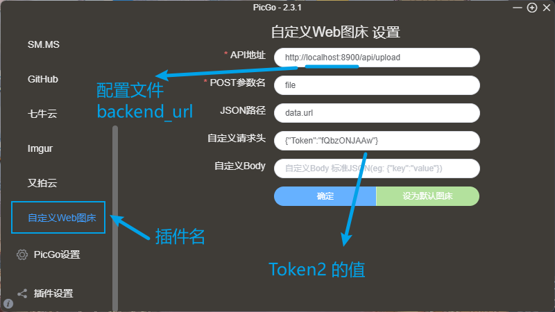

# Obsidian Cloud Storage API 文档

> Obsidian Cloud Storage API 。基于 Obsidian S3 存储的后端 API。支持微信测试号发送消息，保存到s3。支持简悦 SimpRead Webook，支持 fv悬浮球文字图片分享保存, 支持静读天下高亮笔记 api

两个版本:  
[Obsidian S3 存储的后端 API python 版本](https://gitee.com/kkbt/obsidian-csapi)  
[Obsidian 云存储后端 API Go 版本](https://gitee.com/kkbt/obcsapi-go)

博客教程及效果（小白图文版）: [https://www.ftls.xyz/posts/obcsapi-fc-simple/](https://www.ftls.xyz/posts/obcsapi-fc-simple/)
视频效果演示：[Obsidian 从本地到云端-哔哩哔哩](https://b23.tv/uJFvw3A)

前端 Demo [https://kkbt.gitee.io/obweb/#/Memos](https://kkbt.gitee.io/obweb/#/Memos) 第一次加载不正常显示，后端加载慢属于正常现象。

Python 版本容易在阿里云-云函数服务处修改和部署，完全不需要安装任何 Python 环境就可以简单修改。Go 版本性能高一些，实现了邮箱登录链接的功能，但是缺少微信文章剪裁的功能，而且修改需要 Golang 语言环境。

基于 Obsidian S3 存储的后端 API ,保存到 S3 存储的 Obsidian 库。支持列表

- 微信测试号 微信到Obsidian
- 支持简悦 SimpRead Webook
- 支持 fv悬浮球文字图片分享保存
- 静读天下 MoonReader 高亮标注 仿 ReadWise API
- 通用 http api


## Python 版本部署

[Obsidian S3 存储的后端 API python 版本](https://gitee.com/kkbt/obsidian-csapi)  

###  微信到Obsidian 介绍
微信测试号发送消息，保存到COS。被Obsidian插件Remotely Save同步到笔记中。使用 Flask + Vue 。前端在 https://note.ftls.xyz/#/ZK/202209050658 中，就是一个 md 文件。需要 vue , markd , axios 三个 js 。 源码 F12 自取。使用 localStorge 存储 api 地址和 token 。另外前端基于 https://gitee.com/kkbt/obweb  。

- 支持图片和文字
- 图片下载到存储本地，而非链接(微信发送的图片，会给咱们的服务器返回图片URL)
- 对用户的判断，仅限特定用户存储笔记。(根据 OpenID 判断)
- 检索文字中含有 "todo" ，则生成勾选框。如 `- [ ] 13:11 somethingtodo`
- 正常生成 `- 13:11 something`
- 内容能在 Obsidian 插件 Memos 中正常显示
- 支持消息类型: 文字，图片，链接(收藏中的)，地图位置，语音消息(直接调用微信转文字存储)。
- 提供三天查询，一天修改，当日新增后端 api 。
 
BUG:

- 不推荐批量传图片，推荐显示已保存后依次上传。
- 不推荐一秒内上传多个文件，图片命名精确到1S。1S内多图片会覆盖。
- 不要使用微信自带的表情符号，请使用输入法表情。
- 如果微信输入框换行或分段，只会在这一条消息最开始有 `- 13:11 `。也就是说，第二行、第二段不会在 Memos 中显示。


启动程序请运行 app.py

### 部署

#### 方法 1 阿里云函数计算 FC 部署 (推荐)

1. 拉取项目，或下载 zip 压缩包，解压。
2. 打开并填写 config.ini 中配置。可以使用随机生成密码等程序生成 token 之类的。不要出现 %，空格，换行 。而 ^!@$ a-z A-Z 0-9 是可以的。完成后，在 obsidian-caspi 目录下全部选中，压缩为 zip 。也就是说，解压后会出现一堆文件而非一个文件夹。
3. 打开 阿里云函数计算 FC 控制台，新建服务，新建函数。新建函数使用自定义运行时平滑迁移 Web Server 。 请求处理程序类型为处理 HTTP 请求。运行环境 Python 3.9 。通过 zip 上传代码。（就是第二步制作 zip 代码包）。启动命令: `python app.py`。监听端口 9000 。高级配置建议：弹性实例 内存规格 128 MB （实际约用 100 MB）。实例并发度 20 或缺省。其余保持缺省值即可。 
4. 在阿里云函数计算 首页/服务列表/服务 xxxx 详情/函数管理/ 函数代码/ 函数详情 页面有一个网页版代码编辑器。终端里运行
```bash
pip install --upgrade pip
pip install -t . -r requirements.txt
```
请确保成功运行。  
5. 完成后在 函数详情-函数代码 处检查并部署。在 部署按钮旁边 或者 函数详情中-触发器管理 ，找到公网访问地址 了，形似 https://someone.cn-hangzhou.fcapp.run 。  
6. 在微信测试号网站中，接口配置信息 URL 为 公网访问地址+ /api/wechat 。如 https://someone.cn-hangzhou.fcapp.run/api/wechat 。token 为 config 中 WeChat 的 Token。如果配置正确，接口配置信息能成功提交。  
7. 测试服务是否好使，使用测试号发送文字，图片，链接(收藏中的)，地图位置，语音消息。打开 Obsidian 刷新 remotely save 查看效果。如果不好使，请在 首页/服务列表/服务 xxxxx 详情/函数管理/函数详情/调用日志/函数日志。打开 自动刷新 并实时查看异常和报错，以便修改代码，配置，反馈等等。  
8. 正常后。微信测试号发送消息返回的链接，已保存的网址，进入网站。按下齿轮，勾选 Debug。拉到页面下面，两个输入框，第一个是后端api。第二个是 token。api填写类似 api.ftls.xyz/ob ，不需要协议头和尾部斜杠。另外token将加入到和后端 api 的 headers 中 Token 字段。填写完成后，点击 updateConfig 按钮并刷新页面。按函数计算fc格式，第一个框如 https://someone.cn-hangzhou.fcapp.run/ob ，第二个框 `7$w8nA31OAoW@31^3!@$` (是 config.ini 中的 right_token)  
9. 其余，如静读天下，简悦等请查看 app.py api 说明确定 url 。根据 config.ini 中的 各个 token ，填写 token。

注意: 函数计算 FC 部署，使用按量实例模式。会有冷启动时间，并且大约十分钟会销毁实例，在实例列表可以看到运行的实例。这就导致有时，响应时间会大于 5s 。会触发微信的重传机制，所以新建函数时，实例并发一定不能为1。这样重传保证传到一个实例内。另外，大约十分钟会销毁实例时。 messagelist 会清空。相当于重新启动了服务。

为减少冷启动时间，可在 首页/服务列表/服务 xxxxx 详情/函数管理/创建规则 配置规则(会增加费用)。也可设置定时访问。详细见 [阿里云 函数计算冷启动优化最佳实践](https://help.aliyun.com/document_detail/140338.html)

#### 方法2 服务器运行

安装依赖，服务器直接运行，（建议使用宝塔 python 项目管理器），然后 Nginx 反向代理到自己的域名。注意由于阿里云函数计算 fc 计算机时间为 +0。程序已经 特意 +8 使时间正常。所以若方法二部署，一般需要修改 obcs.py 中 def timeFmt 函数 中的 8 为 0。

#### Docker 部署

!!! docker run 之前确保 config.ini 存在，否则会生成一个 config.ini 的文件夹。运行会出错。  !!!   
打包示例
```sh
git clone https://gitee.com/kkbt/obsidian-csapi
cd obsidian-csapi/
docker build -t obcsapi:v3.1 .
docker run -d -v /home/obcsapi/config.ini:/app/config.ini --name obcsapi -p 3023:9000 obcsapi:v3.1
```
使用示例 镜像 https://hub.docker.com/r/kkbt/obcsapi/tags
```sh
docker pull kkbt/obcsapi:v3.1
docker run -d -v /home/obcsapi/config.ini:/app/config.ini --name obcsapi -p 3023:9000 obcsapi:v3.1
```

### 其余配置 

#### 简悦 Webhook 配置

简悦-服务Webhook 填写样例
```json
{"name": "WH2COS","url": "http://127.0.0.1:9000/webhook","type": "POST","headers": {"Content-Type": "application/json","Token": "your_simp_read_token"},"body": {"url": "{{url}}","title": "{{title}}","desc": "{{desc}}","content": "{{content}}","tags": "{{tags}}","note": "{{note}}"}}
```


### 其他

说明: 不推荐批量传图片，程序对图片处理非常粗糙。。例如1M带宽服务器，连续传五个图片时。造成费时间会超过五秒，触发微信重传机制。这个机制带来的问题有很多。比如会多上传几份重复的文件，并且在微信测试号显示服务故障。(其实解决方案有很多，如使用任务队列或者是异步的方式。先返回success，另外开线程上传文件，然而低成本模式下会有一些反馈成功，实际失败的问题，所以暂时使用同步)。

### flask 使用及开发说明

app.py -> flask 运行文件  
obcs.py -> 调用 boto3 S3 api 的库文件，可用于 腾讯云 COS，阿里云 OSS ，aws s3 等 ，使用 s3 兼容接口。  
robot.py -> werobot 微信公众号机器人  

obcs_cos.py -> 已经弃用的 cos s3 api ，可用于 腾讯云 COS  代码包会小一些

app.py api 说明:

- GET /ob/today 返回一个 JSON 格式 daily，包含1天
POST /ob/today 以 Obsidian Memeos 形式增加一条 Memeos ,eg: \n- [ ] 12:00 some
- POST /ob/recent 返回一个 JSON 格式 daily，包含3天
- POST /ob/today/all 覆盖今日 daily md 文件
- POST /webhook SimpRead 服务 Webhook 使用。可以使用 kiwi浏览器 ，在手机上收藏裁剪网页。
- POST /ob/fv 安卓手机fv悬浮球，自定义任务 http 请求推送文字或图片。存储到 S3 中，在 Obsidian 中显示。


更多说明和效果图[Obsidian 从本地到云端](https://www.ftls.xyz/posts/obcsapi-fc-simple/)和[效果图](https://note.ftls.xyz/#/ZK/202211211259)  
演示和教程 见 [https://www.bilibili.com/video/BV1Ad4y1s7EP/](https://www.bilibili.com/video/BV1Ad4y1s7EP/)

## Go 语言版本

见 [https://gitee.com/kkbt/obcsapi-go](https://gitee.com/kkbt/obcsapi-go)

与 python 版本对比

|                | python        | go           |
| -------------- | ------------- | ------------ |
| 体积           | 未压缩 100Mb+ | 未压缩15Mb   |
| 正常响应时间   | 500ms上下     | 250ms上下    |
| FC函数计算内存 | 100Mb 上下    | 20Mb  上下   | 
| 修改难度       | 简单          | 比python复杂 |

若有更高性能需求，可自行修改 golang 源码，并编译打包。不过 golang 功能要少一些（没有收藏微信文章功能）。新特性：可以发送邮件发送登录链接，这样配合 token 的自动失效能稍微安全一些，不过我还是不太擅长前端，很简陋。


基于 Obsidian S3 存储的后端 API ,保存到 S3 存储的 Obsidian 库。支持列表

一个简易前端（后有图）
微信测试号 微信到Obsidian  
支持简悦 SimpRead Webook  
支持 fv悬浮球文字图片分享保存  
静读天下 MoonReader 高亮标注 仿 ReadWise API  
通用 http api  
邮件发送登录链接


后端定时更换 Token 。实现了一个邮件发送登录链接，从而实现前端登录。

两种 token 
1. 全权限 token 包括增删改查 （有效期内可用，配置中写明邮件，发送到邮箱从而获取有效 token）
2. 只能发送信息的 token (只要不改一直有效)

### 部署

复制 config.examples.yaml 为 config.yaml 。部署时建议把项目文件夹内文件都复制过去。（至少包含 template , token 两个文件夹中，及其相关内容。 tem.txt 和 config.yaml 两个文件。


现在这玩意算是能用，但是这个 token 系统还称不上好用。

### 图床功能 PicGo 配置




### 图床 PicGo-Core 类似 cli 工具

概述：用于上传到 Obcsapi 图床的专用命令行工具。可配合 Obsidian 插件 Image Auto upload Plugin ，实现 Obsidian 图片上传。

下载地址： [https://gitee.com/kkbt/obcsapi-go/tree/master/images-host-cli/out](https://gitee.com/kkbt/obcsapi-go/tree/master/images-host-cli/out)

windows，linux，mac 下

```cmd
obcsapi-picgo.exe :: 没有配置则生成配置
obcsapi-picgo.exe u .\1.png .\2.jpg :: 上传本地图片 1.png 2.jpg
obcsapi-picgo.exe u  :: 上传剪切板图片，如果有的话
obcsapi-picgo.exe u https://cdn.ftls.xyz/images/2022/11/zhishi2.jpg :: 下载网络图片，并上传
```

配置说明，第一次运行会自动生产配置。有三行
```
http://127.0.0.1:8900/api/upload
fQbzONJAAw
url
```

第一行是上传链接
第二行是 token2 的值，程序会在请求 Header Token 设置为该值
第三行是选 url or url2 。url 是 http ；url2 是 https

除了命令行运行之外，还可配合 Obsidian 插件 Image Auto upload Plugin .选择 Picgo-Core 模式，路径选择可执行文件在的位置 如 `C:\CLI\obcsapi-picgo.exe`。也可以改名，为`picgo.exe`。

### 展示

后台发送的邮件


点击进入的样子


### 开发说明

Go 语言开发

入口文件  

- server.go 可按照需求，删减相关路径。
- mail.go 邮件相关代码
- s3.go 对 对象存储 操作相关的代码
- token.go Token 的生成，修改，验证代码
- wechat.go 微信公众号/测试号，相关代码
- handlers.go 其余路径的一些代码

文件说明

- token/token1 存储 token1 全权限 token 
- token/token2 存储只发送 token2 用于一些只发送的其他第三方程序 api
- template/index.html 前端文件，一般不使用。但是也可以用。在配置文件中修改前端地址。邮件登录链接就会使用相关前端
- template/404.html 404 文档
- tem.txt 存储请求的 markdown 文本（因为 s3 sdk 文档很复杂，暂时用这方法）
- build.sh 将 go 打包成无链接的静态文件
- http/test.http vscode 插件 postcode 使用的，用于测试


## Q&A 常见问题

### Q: 使用云函数，有时响应很慢
A: 云函数会销毁长期不用的实例。这个时间可能只有几分钟。过了一定时间，再次访问会重启启动实例运行。这就是冷启动，想要减少这个时间，参考[函数计算冷启动优化最佳实践](https://help.aliyun.com/document_detail/140338.html)。最简单低廉的方法，大约是每 5 分钟左右就请求一次。这个请求可以在 阿里云-云函数-定时任务 中设置。

### Q: 微信测试号没有响应
A: 接口配置信息 URL 为 公网访问地址+ /api/wechat 。如 https://someone.cn-hangzhou.fcapp.run/api/wechat 。token 为 config 中 WeChat 的 Token。如果配置正确，接口配置信息能成功提交。

### Q: 提示  “SecondLevelDomainForbidden” 错误 如[I656IE: 不知道哪里出问题](https://gitee.com/kkbt/obsidian-csapi/issues/I656IE)
A: 类似
。解决方法参考 [https://help.aliyun.com/document_detail/375241.html](https://help.aliyun.com/document_detail/375241.html)。一般错误原因，是配置中使用 https://examplebucket.oss-cn-hangzhou.aliyuncs.com 类似格式 。

推荐使用Virtual-Hosted Style的访问方式。因为这个可以提高访问性能，少一跳。
配置示例：

|配置项目名	|OSS	|COS|
|---|---|---|
|s3Endpoint	|oss-cn-beijing.aliyuncs.com	|cos.ap-beijing.myqcloud.com|
|s3Region	|oss-cn-beijing	|ap-beijing|
|s3AccessKeyID	|AccessKey 获取	|AccessKey 获取|
|s3SecretAccessKey|	AccessKey 获取	|AccessKey 获取|
|s3BucketName|	obsidian	|obsidian-123|