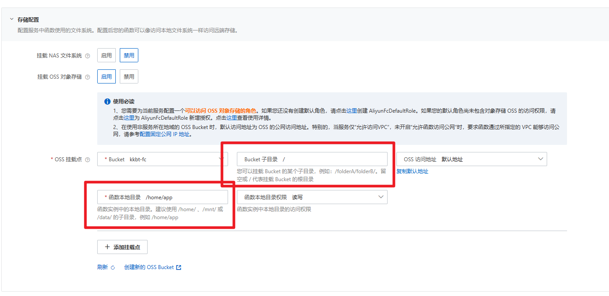
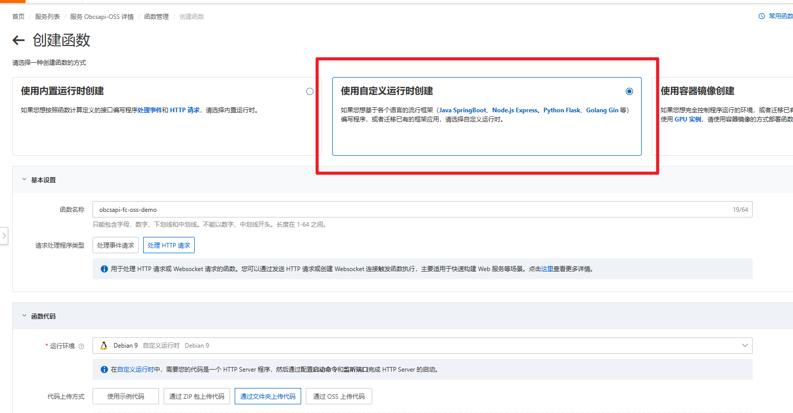
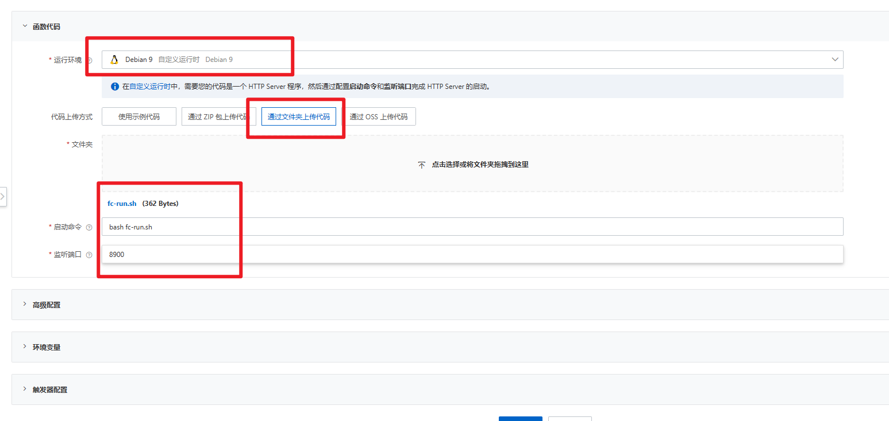

### 部署说明

下载 releases 提供的包，复制 config.examples.yaml 为 config.yaml ，修改账户密码和其他配置，然后在 Linux 环境运行 server 文件。如果是云函数环境，可以参考和运行 fc-run.sh ，进行部署。


部署方法

1. 拉取项目，构建部署
2. Docker 部署
3. 阿里云云函数 FC 运行构建的程序或 Docker

#### 构建 server

```bash
cd server/
go run .
go build -o server  -ldflags '-linkmode "external" -extldflags "-static"' .
```

#### Docker

```sh
# 构建镜像
docker build -t kkbt/obcsapi:v4.2.8 . 
# 运行 Docker
docker run -d -p 8900:8900 --name myObcsapi4.2.8 -v /home/kkbt/app/obcsapi-go/:/app/data/ kkbt/obcsapi:v4.2.8
# 或者通过 cp 方式修改好的 config.yaml
docker cp config.yaml myObcsapi4.2.8:/app/data/config.yaml
docker restart myObcsapi4.2.8
```
如果 -v 后文件出现没有权限访问的问题，可在宿主机执行 `sudo chmod 777 -R /home/kkbt/app/obcsapi-go/` 。

#### 云函数部署(最简)

同博客: [https://www.ftls.xyz/posts/20230609/](https://www.ftls.xyz/posts/20230609/)

这种部署方式需要开通云函数服务和对象存储服务。原理是云函数挂载对象存储，使用对象存储内的 Obcsapi 程序，配置等。Obcsapi 使用本地存储数据源，存储到同一个对象存储中。

请使用者注意使用费用，如果库中文本文件多，体积较小，费用会比较低；如果是文件占用空间大，建议考虑购买服务器或者使用对象存储，因为云函数的流量并不便宜（0.5元/GB）。如使用 Obcsapi 的图床等功能，也注意使用费用。

1. 下载最新版本的 releases 压缩包，可根据自身需要修改其中配置文件
2. 创建一个和云函数服务地域相同的对象存储，然后在文件管理中创建一个文件夹，名称可以是 `fc` 或者 `_fc` ，如果打算云函数和对象存储就使用这一个库，使用`fc`作为文件夹名称，库中会多出一个文件夹和多个文件，可以在 Obsidian 库中修改配置文件等，或者使用对象存储服务商，Alist 等进行文件管理；`_fc` 文件夹 Obsidian Remotely Save 默认不会进行同步。


3. 创建文件夹 `fc` 后，点进去，然后将压缩包内容解压上传到该文件夹。完成后，`fc`目录可以看到 server config.yaml 等文件则代表正确。
4. 新建一个云函数服务，挂载刚刚创建的对象存储服务， Bucket 子目录选择 `/` 根目录，函数本地目录挂载到 `/home/app/` 目录。



5. 新建一个云函数服务下的云函数，环境选择 Debian9 环境即可，内存CPU选择最小的就可以（一般运行占用 40MB 内存），然后选择文件夹上传，把压缩包内的 `fc-run.sh` 这一个文件上传就可以了。运行程序填写 `bash fc-run.sh`。端口填 8900 。然后部署，进行测试。





6. 完成部署后，会跳出函数代码界面，可以看到上传的 `fc-run.sh` 文件，文件内容如下

```bash
#!/bin/bash
# 如选择挂载 OSS 对象存储，请先将压缩包内文件放到 OSS 中 , 并根据相应的的目录配置云函数挂载目录
cd /home/app/fc/
./server
```

该文件只有两个步骤，进入对象存储挂载目录下的 fc 文件夹，运行 fc 文件夹下的 server 可执行文件。

7. 点击测试函数，执行成功，则代表部署成功。可以复制 公网访问地址 URL ，并将这个网址作为 Obcsapi 前端的服务器地址。

8. 由于默认 Obcsapi 默认根目录会在对象存储 fc/webdav/ 文件夹下 ，因此需要在前端更改库文件夹位置，前端登录，默认账户密码在配置文件中有设置，齿轮-Server Setting-WebDAV-库文件夹位置 改为 `../../` 。然后保存即可。此外，如何想使用图床，需要更改配置文件中的 `backend_url_full` 为云函数 URL，并且 齿轮-Server Setting-图床-BaseUrl  填写 `fc/webdav/images/` 即在 Obsidian 库中使用图床上传的本地图片了。

9. 至此，云函数已经部署完成，将对象存储作为 Obsidian 的库，可以使用 Obsidian 的插件 Remotely Save ，见[Obsidian 同步 Remotely Save S3 配置指南](https://www.ftls.xyz/posts/obsidiannote/)，也可以选择使用 Alist 挂载对象存储，然后使用 Alist WebDAV 服务，使用相关软件挂载 WebDAV 为本地新盘。需要注意的是，截止 2023 04 09 阿里云云函数不支持 webdav 一些方法，如列出，所以无法使用 Obcsapi Wevdav 服务。

> *注意：* 这种部署方法，fc云函数由于采用的是内网方式运行对象存储内的服务，所以内网流量较多，虽然是免费的。但也可以配置更高效的方式，如云函数同时上传 `server` 这个可执行文件，然后 `fc-run.sh` 文件内容如下

```bash
#!/bin/bash
cd /home/app/fc/
/code/server
```

这样即可运行云函数上传的 server 文件，减少内网流量。

>用于阿里云云函数部署 由于自然分词（按 full 词典）等原因 实例刚刚创建时，巅峰内存为 300Mb + ，平时运行也在 200Mb +。可以通过选择更小的分词词典，减少内存。最低约 17Mb 。但是分词效果就并不好了。


#### ARM设备部署(最便宜？) 仅想法


经过测试，程序可以在手机 termux 上正常编译运行。
经过测试，可以在玩客云运行。（armv7 架构）

其余设备想法，待验证。

1. 使用棒子(使用高通410的随身WIFI)，刷 Debian 系统，golang 编译到 ARM 平台运行。
2. 使用树莓派运行
3. 使用玩客云/电视盒子刷 Linux 系统运行

其中 随身 WIFI 网友评论有以 2 元价格购买，玩客云约 20-30 ,电视盒子大约 50 。

#### 借助云平台部署

参考 memos 可用平台

Zeabur
fly.io
Render
Render.com
PikaPods.com  EU and US regions available.

