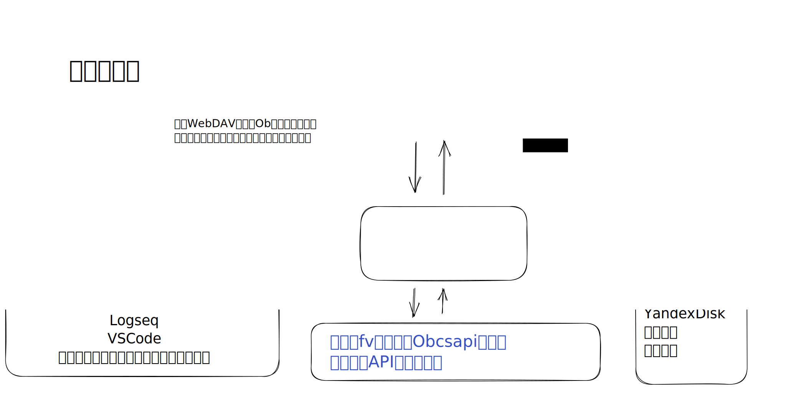
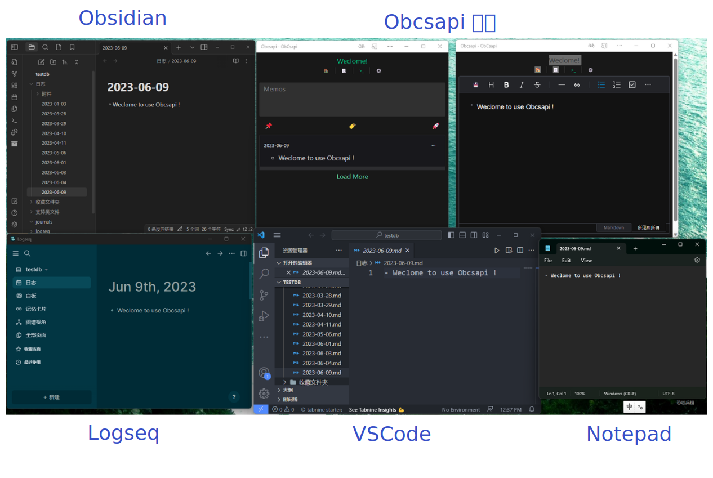

## Go 语言版本

基于 Obsidian S3 存储， CouchDb ，本地存储和 WebDAV 的后端 API ,可借助 Obsidian 插件 Remotely-Save 插件，或者 Self-hosted LiveSync (ex:Obsidian-livesync) 插件 CouchDb 方式，保存消息到 Obsidian 库。

如果你不使用 Obsidian ，也可以借助坚果云，或者 WebDav 进行文件同步，配合其他文本编辑器使用。

绘图 PowerBy [Handraw](https://handraw.top/)

更多截图见上游文档。

前端地址: 部署后访问根路径。

下载详见 [GitHub Releases](https://github.com/dangehub/obcsapi-go/releases)。
